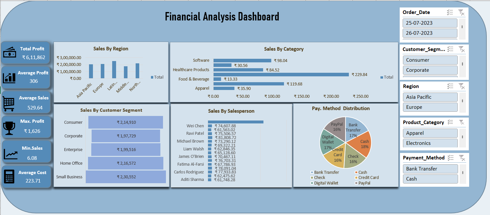

# Financial Analysis Dashboard

An interactive Financial Analysis Dashboard created using Microsoft Excel to analyze sales, profit, cost, orders, and overall business performance.

## Tools Used

- Microsoft Excel
- Pivot Tables
- Pivot Charts
- Excel Formulas
- Data Analysis
- Data Visualization

## Key Highlights

- Sales and profit performance analysis
- Cost and order analysis
- Region-wise performance analysis
- Customer and salesperson analysis
- Payment method analysis
- Interactive KPI tracking and visualizations

## Dashboard Preview

## Project Insights

The dashboard transforms raw business data into meaningful insights using Excel-based analysis and interactive visualizations. It helps identify sales trends, profit performance, regional patterns, and customer insights to support better business decision-making.
